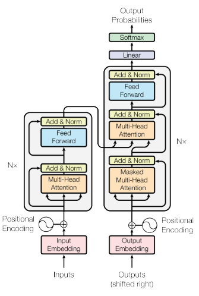
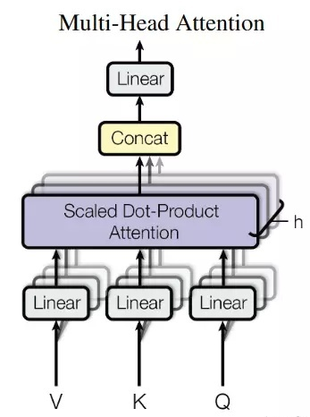

# 1. 选题依据与价值

## 1.1 课题背景

随着自然语言处理(Natural Language Processing, NLP)领域研究的不断深入，学者们的研究已经不只停留在词法解析、句法解析等表层信息的处理上了，让机器理解语义正渐渐成为学者们的研究目标，而自然语言推理作为自然语言理解的重要组成部分，也成为自然语言处理的一项研究热点。

自然语言推理(Natural Language Inference, NLI)通常是指识别文本间的蕴含关系，所以通常也称为文本蕴含关系识别(Recognize Textual Entailment, RTE)。

## 1.2 应用价值

文本间的蕴含关系普遍存在于自然语言文本之间，所以文本蕴含关系识别在许多自然语言处理领域都存在着实际应用价值。本节将列出一些文本蕴含关系识别的应用[@MacCartney2009]。

**问答系统** 一个理想的文本蕴含系统可以作为问答系统的答案验证模块，用来判断一个从知识库种抽取的候选答案是否能够推断出目标问题或是目标问题的陈述句形式。例如，某人提问“港珠澳大桥的总工程师是谁？”，通过信息检索技术从知识库中检索出候选答案“林鸣，自2010年12月起，担任港珠澳大桥岛隧工程项目总经理、总工程师”，利用文本蕴含系统可以验证是否可以从候选答案推断出目标问题。为检验文本蕴含系统的这种能力，欧洲跨语言评测平台(Cross Language Evaluation Forum, CLEF)在2006-2008举办了三届答案验证评测(Answer Validation Exercise, AVE)。在评测中，每一条数据由一个问题、一个候选答案和一篇支持文本组成，文本蕴含模型的目标就是在给定支持文本的情景下，针对目标问题，判断候选答案是否正确。

**语义检索** 语义检索的目标是基于检索语句的语义从大量的文档库中检索出目标文档的目标语句。如果将文本蕴含系统运用在语义检索中，它可以用来识别目标问题与目标源文档中各个语句的语义相似性。例如，用户搜索“人们示威反对自由贸易”，现存的基于关键字的搜索引擎将会返回包含“示威”、“自由贸易”等关键字的文档，如果文档中仅存在像“游行人员高举‘反对解除贸易壁垒协议’的标语”这样不含关键字的语句，那将不会被检索到，而造成信息遗漏，利用文本蕴含识别可以避免上述问题。

**自动摘要** 在自动摘要任务中，一个主要的挑战是怎样消除冗余。冗余现象在多文档摘要中特别明显，多文档摘要是融合了多篇源文档的内容，而多篇文档之间的内容可能存在语义相似的，从而造成自动生成的摘要中存在多条语句表达相似语义的问题。文本蕴含识别系统用来判断是否存在语句所表达的语义可以由其他摘要语句推理得到。自动摘要的另一个挑战就是正确性，也就是摘要应该准确地反映单个源文档或多个源文档的内容。文本蕴含识别系统可以通过判断源文档是否可以推理出摘要，以确保摘要的正确性。

**机器翻译的自动评估** 文本蕴含识别的一个相对比较新的应用就是自动评估机器翻译的性能。目前，机器翻译研究者主要利用BLEU作为翻译好坏的指标，BLEU是通过衡量机器翻译语句与人类翻译语句之间的重合程度来，并没有考虑语义层次的相似性。而文本蕴含识别可以判断机器翻译的语句是否可以推断出人类翻译的语句，若可以推断出，则可以认为这是一个好的翻译，即使机器翻译的句子与人类翻译的句子之间没有一个字是一样的。

# 2. 国内外研究现状
&emsp;&emsp;文本蕴含识别作为自然语言处理领域里一项重要研究内容，是许多 NLP 应用的基础，吸引着世界各地研究者的广泛关注。为了促进文本蕴含识别理论方 法的实用化，每年都有一些相关评测比赛举行。正是这些语义评测比赛的举办 推动着文本蕴含识别的发展。早期的方法主要是在这些小规模的评测语料上进 行实验。2015年，Bowman 等人[@N18-1101]发布 SNLI 语料库的发布，使得文本蕴含识别的语料库规模增加 了几个量级。越来越多的研究者开始利用深度学习方法来解决文本蕴含问题。 因此，从大体上来讲，可以将文本蕴含识别方法分为两类：传统文本蕴含识别 方法和基于深度学习的文本蕴含识别方法。下面对这两类 RTE 方法进行介绍。

## 2.1 传统文本蕴含识别方法研究现状
&emsp;&emsp;近十年来，有许多 RTE 相关评测比赛举行，主要的评测比赛列举于表 1-3 中。这些评测通常有这样一些特点：评测中的例子是多来源的，包括新闻素材 和图片标题等等，因此开发出的系统必须是领域独立开放的；同时，所需要做 出的推断都是从人类思考的角度进行的，并不需要非常严密的逻辑推理，也不 包含多阶段的“长链”的推理。评测对文本蕴含的定义并不是很精确，没有正 式的定义，绝大多数拥有基本常识的人都能得到一致的答案。 参赛者在这些评测语料库上提出了许多有效的文本蕴含识别方法。这些方法主要可以分为三类：基于特征结合分类器的方法、基于逻辑推理的方法和基 于对齐的方法。下面对这三类主流方法分别进行介绍：

### 2.1.1 基于特征结合分类器的方法 
&emsp;&emsp;基于特征结合分类器的方法是文本蕴含识别的主流方法。它可以通过分类器将多种有效特征整合起来，例如：多种相似度特征。甚至是许多其他文本蕴 含识别方法的结果也可以作为它的特征。这类方法非常依赖于词性标注，共指 消解，命名实体识别等自然语言处理的基础技术，通常会引起错误的后向传播。 也非常依赖于外部资源。 
### 2.1.2 基于逻辑推理的方法 
&emsp;&emsp;基于逻辑推理的文本蕴含识别的好处是这种技术不依赖于背景知识，而这些背景知识通常不容易获取。这类方法会使用一些现有的逻辑推理工具，将句 子转换成一个正式的逻辑表示（例如：命题或一阶谓词等），然后基于知识库中 的事实运用相关推理规则判断两个逻辑表示之间的蕴含关系。在进行推理时， 所使用的知识通常是领域相关的，在开放域文本蕴含任务上有一定的局限性 。 
### 2.1.3 基于对齐的方法 
&emsp;&emsp;基于对齐的方法通常通过一些对齐算法来决定前提句和假设句之间的对齐关系，然后从中挑选出一个子集并认为该子集代表两句子之间最相关的部分。 最后将子集的对齐结果作为判断蕴含关系的依据。在对齐过程中一般会遍历所 有可能的组合，利用一个打分函数来判断对齐的质量。与传统基于相似度的对 齐打分函数不同，文本蕴含中的打分函数需要重点考虑一些对判断蕴含关系起 到重要的作用的细节（例如：动词的否定、反义词和主被动关系词等等）。这些 对齐函数的目标并不是寻找绝对正确的对齐关系，而是寻找对下阶段判断蕴含 关系最相关的对齐关系。有些工作专门将研究重点集中在学习这样的对齐算法上。另外，基于对齐的方法产生的结果也常用作基于分类器算法的特征。  
&emsp;&emsp;此外，还有一些基于变换的方法、基于核的方法和基于词法语义资源的方法提出。

## 2.2 基于深度学习的文本蕴含识别方法研究现状
&emsp;&emsp;深度学习也可以称作表示学习，通过神经网络可以自动的学习多层次的复 杂抽象特征。常见的应用于自然语言处理领域中的神经网络有递归神经网络和 卷积神经网络。深度学习在语言模型、中文分析、知识挖掘、情感计算、机器翻译、信息检索、命名实体识别、语义角色标注等任务上都取得了非常好的结果，在大多数任务中都超越了传统的机器学习方法的最好水平。
&emsp;&emsp;由于早期文本蕴含识别的语料库规模较小，利用传统方法会带来错误传播和工作量大等问题，而神经网络模型能有效避免这些问题。随着 SNLI 的发布，许多研究者都开始探索利用深度学习技术来解决文本蕴含识别任务。目前，针 对英文文本蕴含识别任务，国内外的研究者已经探索尝试出了一些深度学习方 法，领先水平的方法列举于表 1-4 中。这些方法主要可以分为两大类：基于句 子表示的方法和基于句子匹配的方法。下面对这两类方法分别进行介绍。
### 2.2.1 基于句子表示的方法 
&emsp;&emsp;基于句子表示的方法通常通过某种神经网络将前提句和假设句分别编码成定长向量，然后对这一对向量进行匹配，最后将得到的匹配向量送入后续神经 网络中完成分类任务。Bowman 等使用长短期记忆网络(Long Short Term Memory，简称 LSTM) 分别对前提句和假设句进行编码，得到两个 100 维的句 子表示向量，然后将两个句子表示向量连接后送入三层包含 200 个隐含节点的 tanh 层中，最后通过 Softmax 层进行分类。他们的 SNLI 语料库上取得 77.6% 的准确率。将句子向量维度更改为 300 后准确率提高到 80.6%。Vendrov 等利用预先编码好的 ordered-embedding 输入到 GRU 中来训练得到句子向量，将两 个句子向量和两个向量相减后的绝对值向量相连，然后进行分类，他们在 SNLI 语料库上取得了 81.4%的准确率。Mou 等利用基于依存树的卷积神经网络来 分别编码两个句子，将编码后的向量进行相连、按位相减和按位相乘操作，最 后相连后在结果向量的基础上分类，它们在 SNLI 的准确率为 82.1%。近期，Bowman 等又提出了 SPINN (Stack-augmented Parse-Interpreter Neural Network) 编码器，该编码器利用一个树形结构从左到右顺序扫描输入词串，它的设计参 考了 shift-reduce 分析器的思想，既能接受句法分析的输入，也能接受原始词串 输入，其实验结果达到了 83.2%，这是这类方法目前的最好水平。
### 2.2.2 基于句子匹配的方法 
&emsp;&emsp;基于句子匹配的文本蕴含识别方法不生成句子向量，直接针对任务产生匹配向量进行分类。这类方法都引入了在多个任务中都表现优良的Attention机制。 实际上，他们的主要工作就是针对文本蕴含识别任务对Attention机制进行改进。 Attention 机制类似于人类的注意力机制，能够关注于句子中相对重要的部分。 Attention 机制在文本蕴含识别中的作用就是关注对判断句子蕴含关系起到重要 作用的词，给予相对较高的权重，然后根据 Attention 权重产生匹配向量来完成 分类任务。这类方法都取得了非常不错的效果。Rocktäschel 等人[26]提出了在文 本蕴含识别中的Attention和Word-by-Word Attention分别取得了82.3%和83.5% 的好成绩。Wang[27]和 Chang[28]在 word-by-word attention 的基础上进行改进，分 别提出了 mLSTM 和融合 memory network 的 LSTMN，结果上都取得了不错的提升。  
&emsp;&emsp;综上所述，传统文本蕴含识别方法通常需要基础 NLP 技术和外部语义资源的支持，比较费时费力，方法相对比较复杂。基于深度学习的文本蕴含识别方 法能够有效避免上述两类问题，并且取得了很不错的效果。因此，本文的研究 重点是基于深度学习的文本蕴含识别方法。

# 3. 相关理论和技术
## 3.1 词的表示

## 3.2 循环神经网络(Recurrent Neural Network, RNN)
&emsp;&emsp;循环神经网络 (Recurrent Neural Networks，RNNs) 是一种常见的人工神经网络，网络中结点间的连接线形成有向环，RNN 在许多自然语言处理任务中都 有重要的应用。区别于前向反馈神经网络(Feed-forward Neural Networks，FNNs) 中输入输出是相互独立的关系，RNN 能够有效利用到上一时刻的输出结果。因 此，RNN 用来处理序列数据比较合适12。理论上讲，RNN 可以处理任意长的序列，但在实际中是做不到的。RNN 在语言模型、文本生成、机器翻译、语言识 别和图像描述生成等任务中都取得了很不错的效果。RNN 的训练优化 算法是 BackPropagation Through Time。其展开图如图 3-2 所示:

&emsp;&emsp;在传统RNN网络的梯度后向传播阶段，梯度信号最后会与RNN隐含层中相关的权重相乘多次（次数与步长一样），这就意味着，相关权重的大小会对网络的学习训练过程产生巨大的影响。如果权重太小（或者说是权重矩阵的特征向量小于1.0），就会导致“梯度消失”，梯度变得越来越小使得网络学习过程缓慢，甚至完全停止。对于“长距离依赖”问题，由于梯度消失问题，使得RNN的学习变得非常困难。如果权重太大（或者说是权重矩阵的特征向量大于1.0），会导致梯度爆炸，无法收敛。为了解决RNN 存在的这些问题，Hochreiter 等人[]提出了长短期记忆神经网络单元(Long Short-term Memory, LSTM)。

### 3.2.1 长短记忆神经网络(Long Short-term Memory, LSTM)
&emsp;&emsp;LSTM模型后续被其他研究者进一步改进，目前最常见的两种变种：一是加入了“窥探孔连接”机制，二是 Gated Recurrent Unit (GRU)。LSTM 神经网络就是将 RNN 网络中的隐含层节点替换为 LSTM 单元后形成的网络。一个 LSTM 记忆单元的结构如图 3-3 所示：

&emsp;&emsp;LSTM 的核心是Cell的状态，它通过“门”来控制流入到 Cell 信息，Sigmoid 层的输出为 1 则代表信息全部通过，输出为 0 表示内容被完全阻隔13。LSTM 单元包含三个门来控制 Cell 状态，分别为输入门、输出门和遗忘门。在时刻 ??，Cell 的状态通过以下公式进行更新：
$$i_{t} = \sigma(W^{i}[X_{t};h_{t-1}]+b^{i})$$
$$f_{t} = \sigma(W^{f}[X_{t};h_{t-1}]+b^{f})$$
$$o_{t} = \sigma(W^{o}[X_{t};h_{t-1}]+b^{o})$$
$$g_{t} = tanh(W^{g}[X_{t};h_{t-1}]+b^{g})$$
$$c_{t} = f_{t} \odot c_{t-1} + i_{t}\odot g_{t}$$
$$h_{t} = o_{t} \odot tanh(c_{t})$$
&emsp;&emsp;其中，$i_{t},f_{t},o_{t},g_{t},c_{t}$分别表示，在t时刻，输入门、遗忘门、输出门、输入模块门和Cell的输出;$b^{i},b^{f},b^{o},b^{g}$分别为偏置向量;$W^{i},W^{f},W^{o},W^{g}$为权重矩阵。 
&emsp;&emsp;LSTM学习能力强、表达力强并且容易训练，在NLP任务中应用广泛，实际上，取得了领先水平的RNN网络，绝大多数都是LSTM网络。

### 3.2.2 双向长短记忆神经网络(Bidirectional LSTM, BiLSTM)
&emsp;&emsp;单向 LSTM 的一个缺点是它只能利用出现在当前节点之前的信息。在句子文本建模任务中，充分利用过去和未来的信息能够更全面的掌握语义信息，生成更有效的句子向量。双向 LSTM 利用两个独立的隐含层双向处理文本来达到 同时利用上下文的目的，两个隐含层的结果最后都送入到同一个输出层[38]。如图所示:

&emsp;&emsp;设$h_{f} \in \mathbb{R^{n \times k}}, h_{b} \in \mathbb{R^{n \times k}}$分别是BiLSTM的两个单向LSTM的输入隐状态序列，则BiLSTM的输出为：
$$H = [h_{f}; h_{b}] \in \mathbb{R^{n \times 2k}}$$
## 3.3 Attention机制

## ELMo词嵌入模型[@Peters2018]
&emsp;&emsp;ELMo全称Embeddings from Language Models，是一种目前最先进的词嵌入模型，在多个自然语言理解的数据集上都有较好的表现，在性能指标上都有显著的提升。预训练文本表示在自然语言理解领域具有重要地位，其中Word2vec[@Mikolov2013_1][@Mikolov2013_2]和Glove[@Pennington2014]对预训练词表示起到了关键作用。但是Word2vec和Glove都只是将一个词用一个向量表示，而词在不同的语境中会有不同的语义，而用一个固定的向量来表示一个词则无法体现词的多义性。ELMo的则是引入了一种基于语境的词嵌入方式。 
&emsp;&emsp;ELMo模型是基于大量文本语料，从深层的双向语言模型（deep bidirectional language model）中的内部状态(internal state)训练而来的。深层双向语言模型由多层双向长短记忆网络(BiLSTM)构建而成。ELMo是将BiLSTM中的各层状态向量进行线性组合而得。对于某个词$t_{k}$，可以由一个$L$层的BiLSTM中的$L+1$个状态向量表示如下：
$$R_{k} = \{h^{LM}_{k,i} | i=0, ..., L\}$$
&emsp;&emsp;其中,$h^{LM}_{k,i}$表示BiLSTM第i层的状态向量。然后ELMo将$R_{k}$组合成一个词向量$ELMo^{task}_{k}$，实验发现[@Peters2018]，将$R_{k}$中的所有向量进行加权求和组合并进行缩放具有最好的效果，具体的组合公式如下：
$$ELMo^{task}_{k} = E(R_{k},\Theta^{task}) = \gamma^{task}\sum^{L}_{i=0}s^{task}_{i}h^{LM}_{k,i}$$
&emsp;&emsp;其中$s^{task}=softmax(w^{task})$是归一化后的权重向量,$\gamma^{task}\in \mathbb{R}$可以对整个词向量进行放缩调整。这两个参数都是根据具体任务参与训练的，而$h^{LM}_{k}$从预训练双向语言模型中抽取获得的。 
&emsp;&emsp;当在问答系统、文本蕴含、机器翻译等监督学习任务中，ELMo词向量$ELMo^{task}_{k}$可以与普通的预训练词向量$x_{k}$进行合并得$[x_{k};ELMo^{task}_{k}]$来表示一个词；同时，实验表明将具体任务（例如：SNLI,SQuAD）中的RNN模型的输出$h_{k}$替换成$[h_{k};ELMo^{task}_{k}]$，会获得更好的实验效果。

## Transformer模型[@Vaswani2017Attention]
&emsp;&emsp;Transformer是一种新的Seq2Seq网络结构，完全依赖Attention机制，舍弃了循环神经网和卷积操作，在机器翻译领域取得重大成功。Transformer整体网络结构如图所示：

 
图：Transformer整体结构(Ashish 等人于2017年发表) 

 
&emsp;&emsp;Transformer主要由编码器(Encoder)与解码器(Decoder)组成，由于本文主要采用Transformer的编码器部分，所以下文将主要阐述Transformer的编码器结构。Transformer的编码器主要由多个编码层堆叠而成，每个编码层结构相同，上层编码层的输出作为下层的输入。每个编码层的分别由两部分组成：第一部分是多头自注意力层(Multi-head Self-attention)，第二部分是全连接神经网络(Position-wise feed-forward network)。两个部分都有一个残差链接(residual connection)，然后接着一个 Layer Normalization 层。

### Multi-head Self-attention 机制
&emsp;&emsp;本节先介绍Scaled Dot-product Attention 机制。Vaswani 等人[@Vaswani2017Attention]在论文中曾将Attention机制描述为一个问题(query)与一组键值对(key-value pairs)的函数，函数的输出则是由键值(value)的加权求和得到，其中权重则是由问题(query)与对应的关键字(key)计算得到。设问题(query)$Q \in \mathbb{R^{n \times d}}$，键值对的关键字(key)$K \in \mathbb{R^{m \times d}}$，键值对的键值(value)$V \in \mathbb{R^{m \times d}}$，Scaled Dot-product Attention函数的输出$Attention(Q,K,V)$，则函数输出的计算公式如下：
$$Attention(Q,K,V) = softmax(\frac{QK^{T}}{\sqrt{d}})V$$
&emsp;&emsp;Scaled Dot-product Attention与普通的基于內积的Attention机制的唯一区别就在于scaled dot-product attention 有一个缩放因子$\frac{1}{\sqrt{d}}$，$d$表示词向量的维度，当词向量维度很大时，$QK^{T}$就会偏大，使得softmax函数处于梯度较小的区域，而乘上缩放因子，可以在一定程度上修正这种情况。 
&emsp;&emsp;为在多个层次上获取语义关联，Vaswani 等人[@Vaswani2017Attention]提出Multi-head Attention结构，该机制将问题$Q$,键值对中的关键字$K$和键值$V$分别进行多次线性变换之后，进行Scaled Dot-product Attention操作，再将结果进行合并操作，再次经过线性变换，得到最后最终的输出。Multi-head Attention的网络结构如下图所示：

 
图：Multi-head Attention网络结构 

 
&emsp;&emsp;Multi-head Attention 使得模型能够获取来自不同位置的多个表示子空间的信息。Multi-head Attention操作的公式如下：

$$MultiHead(Q,K,V) = Concat(head_{1}, ..., head_{h})W^{o}$$
$$head_{i} = Attention(QW^{Q}_{i}, KW^{k}_{i}, VW^{V}_{i})$$

&emsp;&emsp;其中$W^{o} \in \mathbb{R^{d \times d}},W^{Q}_{i} \in \mathbb{R^{d \times d/h}}, W^{k}_{i} \in \mathbb{R^{d \times d/h}}, W^{V}_{i} \in \mathbb{R^{d \times d/h}}$分别表示线性变换的权重，$h \in \mathbb{Z^{+}}$表示将Q、K、V 进行线性映射的次数。原始模型使用$h=8$个并行的attention 层。 
&emsp;&emsp;当Multi-head Attention中的问题Q，键值对中的关键字K与键值V均对应着同一个序列时，K=V=Q，则称这种结构为Multi-head Self-attention。这样做的主要是为了学习序列内部各个元素的依赖关系，捕获序列中的内部结构。

### Position-wise Feed-forward network
&emsp;&emsp;Transformer的编码器部分的子层不仅有一个Multi-head Self-attention 层还包括一个前馈神经网络(Feed-forward network)。这个前馈神经网络分别对序列的每个位置的元素做了两次线性变换，两次线性变换之间运用ReLU激活函数。公式如下：
$$FFN(x) = ReLU(xW_{1}+b_{1})W_{2}+b_{2}$$
&emsp;&emsp;其中，全连接层的权重与偏置针对序列中每个位置的元素是共享的。上述操作也可以理解为卷积核尺寸为1的两层一维卷积操作。

### 位置编码
&emsp;&emsp;由于Transformer模型中不包含循环神经网络和卷积操作，所以丢失了序列的时序信息，因此，Transformer模型的输入需要加入时序信息。原模型中使用三角函数对时序信息进行编码，公式如下：
$$PE(pos,i) = \left\{\begin{matrix}
sin(pos/10000^{i/d}) & i=2k,k \in \mathbb{N} & \\ 
cos(pos/10000^{i-1/d})&  i=2k + 1 & 
\end{matrix}\right.$$
$$$$
&emsp;&emsp;其中$pos$表示元素在序列中的位置，$i$表示元素向量的维度。对一个序列中的每个元素都使用sin函数与cos函数相结合的方式进行编码，针对用向量表示的每个元素，对向量的奇数维用cos函数进行编码，对向量的偶数维用sin函数编码。

# 研究内容与实施方案
## 研究内容
### 课题描述

### 数据集介绍
#### SNLI数据集
&emsp;&emsp;2015年，Bowman 等人[@N18-1101]为了促进深度学习在文本蕴含识别中的应用，通过众包的方式，收集了大规模的文本蕴含识别的语料 Stanford Natural Language Inference (SNLI)。SNLI 语料中包含大量的句子对，其中句子对的关系共分为三种，分别是：蕴含关系、冲突关系和中立关系。如果前提文本可以推断出假设文本，那么两句话之间就是蕴含关系（Entailment），如何前提文本可以推断出假设文本是错误的，那么两句话之间就是冲突关系（Contradiction），否则则是中立关系。如下表所示，

&emsp;&emsp;蕴含关系：前提中描述多名男性在玩足球，由此可以推断出多个男人在做运动，从前提可以推断出假设，因此两句话是蕴含关系。冲突关系：前提中描述一个男人在检查一个 人的制服，与这个男人在睡觉显然冲突。中立关系：前提中一个大一点的和一个年轻一点的男人在微笑，而假设中描述两个男人在微笑，并且因为猫在地板上玩耍而大笑。从前提中无法推断出假设是否正确，因此两句话是中立关系。
&emsp;&emsp;SNLI中的原始的训练数据为 550152 对，开发集数据和测试集数据均为10000对。但是在众包过程中的人工标注往往会有一些误差，每对前提和假设经过五人标注，最终以三人及三人以上标注结果相同的标注称为黄金标注。经过规则过滤非黄金标注后的训练数据为549367对，开发集为9842对，测试集为9824对。并且所有数据中，前提的平均长度为14.1，假设的平均长度为8.3，说明通常前提文本中包含的信息比假设文本中包含的信息更加丰富，可以根据这一点来辅助进行文本蕴含识别。SNLI的统计信息如下表所示：

#### MultiNLI数据集
&emsp;&emsp;MultiNLI (Multi-Genre Natural Language Inference) 数据集[@N18-1101]是目前最大的文本蕴含数据集，是Stanford所推出的自然语言推理数据集SNLI的升级版本。MultiNLI数据集总共有433000组句子样本，包含10种不同的领域，风格上包括文本和口语两种英文风格。

## 实施方案
&emsp;&emsp;鉴于Chen 等人所建立的增强序列推理模型(Enhanced Sequential Inference Model, ESIM)ESIM[@Chen2016]在文本蕴含数据集SNLI与MutiNLI上的成功，本文依据ESIM模型总结出基于Bi-LSTM与Attention的文本蕴含识别模型的基本架构，并希望能够对模型的并行计算能力与数据性能指标进行改善。下文将对模型的主要部分进行描述并提出改进计划。

### 基本模型结构
&emsp;&emsp;文本蕴含任务可以抽象为一个三分类任务，模型大致可分为5层，分别为：序列输入层、序列编码层、序列间相关信息抽取层、特征提取及融合层、分类层。序列输入层对文本序列进行向量化的表示；序列编码层将融合词的上下文信息；序列间相关信息抽取层将从假设序列中提取与前提序列相关的信息，同理也从前提序列中提取与假设序列相关的信息；特征提取层提取语义特征信息并将两序列的特征信息进行融合；分类层将提取后的特征信息映射到类别标签。模型的结构如图所示：

#### 序列输入层
&emsp;&emsp;对于序列输入层，本文仅使用预训练的词向量表，并对词向量表中未出现的词进行随机初始化。通过词向量映射表将字符映射为向量，我们得到前提序列$p = \{p_{1}, p_{2}, ... , p_{l_{p}}\}$ 与假设序列 $h = \{h_{1}, h_{2}, ... , h_{l_{h}}\}$，其中$p_{i}, h_{j} \in \mathbb{R^{e}}$。

#### 序列编码层
&emsp;&emsp;为了让序列中每个元素都融合上下文信息，模型利用双向长短记忆网络(Bi-LSTM)分别对前提序列和假设序列进行编码，编码过程可由如下公式所示：
$$\bar{p}_{i} = BiLSTM(p,i), \forall i \in [1, 2, ..., l_{p}]$$ 
$$\bar{h}_{j} = BiLSTM(h,j), \forall j \in [1, 2, ..., l_{h}]$$ 
&emsp;&emsp;其中 $\bar{p}_{i}, \bar{h}_{j} \in \mathbb{R^{h}}$ 分别是一个h维的向量，分别是前提序列的第i个词向量和假设序列的第j个词向量在经过双向长短记忆网络后输出的隐状态向量。双向长短记忆神经网络每个时刻输出的隐状态向量不仅具有序列在该时刻词的信息，并且还包含该时刻词的上下文信息。

#### 序列间相关信息抽取层
&emsp;&emsp;对输入序列进行编码之后，前提序列$\bar{p} = \{\bar{p}_{1}, ...,\bar{p}_{l_{p}}\}$ 和假设序列  $\bar{h} = \{\bar{h}_{1}, ...,\bar{h}_{l_{h}}\}$中每个元素包含着对应时刻词的信息和其上下文的信息，但两个序列之间的联系并没有描述，模型需要对两个序列的关系进行建模描述。局部推理模块利用软注意力(soft attention)机制对两个被编码的序列的各个元素之间的关系进行建模。为了判断假设序列中的每个词是否可以从前提序列中推理出来，最直观的想法是比较两个序列中每个元素之间是否具有蕴含、矛盾或中立关系。模型利用Attention机制对两元素之间的差异进行衡量，首先计算两个序列各个元素之间的相似度$e \in \mathbb{R^{l_{p} \times l_{h}}}$，然后通过softmax操作得到一个权重向量$w_{p \to h} \in \mathbb{R^{l_{h} \times l_{p}}}$，再对前提序列中的每个元素进行加权求和，得到前提序列针对假设序列相关信息向量$\tilde{h} \in \mathbb{R^{l_{h}}}$。同理可得，假设序列针对前提序列的相关信息向量$\tilde{p} \in \mathbb{R^{l_{p}}}$。上述过程可由如下公式表示：
$$\tilde{p}_{i} = \sum^{l_{h}}_{j=1}\frac{exp(e_{ij})}{\sum^{l_{p}}_{k=1}exp(e_{ik})}\bar{h}_{j}, \forall i \in [1, ..., l_{p}]$$
$$\tilde{h}_{j} = \sum^{l_{p}}_{i=1}\frac{exp(e_{ij})}{\sum^{l_{h}}_{k=1}exp(e_{kj})}\bar{p}_{i}, \forall j \in [1, ..., l_{h}]$$
&emsp;&emsp;其中$e_{ij}$表示前提序列的第i个元素与假设序列的第j个元素相关程度，计算元素之间关联程度的方式有很多，本文通过最简单的方式，计算两序列中各个词向量之间的内积来衡量两词之间关联程度，公式如下：
$$e_{ij} = \bar{p}_{i}^{T}\bar{b}_{j}$$
&emsp;&emsp;为抽取序列元素与序列间相关信息之间的语义关系，序列元素和序列间相关信息需要进行交互。本文采用三种交互方式：向量连接、按位相乘和按位相减。交互过程如下公式所示：
$$m_{p} = [\bar{p};\tilde{p};\bar{p}-\tilde{p};\bar{p} \odot \tilde{p}] \in \mathbb{R^{4h}}$$
$$m_{h} = [\bar{h};\tilde{h};\bar{h}-\tilde{h};\bar{h} \odot \tilde{h}] \in \mathbb{R^{4h}}$$
&emsp;&emsp;其中$\odot$表示按位相乘，是深度学习中向量交互的常用方式；需要指出的是，按位相减操作后进行线性变换与直接进行连接操作后进行线性变换是等价操作，但这种方式在许多实验中发现对实验效果有明显提升。 
&emsp;&emsp;本文采用BiLSTM对交互后的信息进行进一步编码，计算过程如下：
$$v_{p,i} = BiLSTM(m_{p},i) \in \mathbb{R^{h}}, \forall i \in [1, 2, ..., l_{p}]$$ 
$$v_{h,j} = BiLSTM(m_{h},j) \in \mathbb{R^{h}}, \forall j \in [1, 2, ..., l_{h}]$$ 

#### 特征提取与融合层
&emsp;&emsp;本文通过池化操作对语义特征进行提取，并将特征向量进行连接操作对特征进行融合。池化操作主要是将平均池化和最大池化相结合，然后将池化后的向量进行连接操作，形成一个长度固定的向量$v \in \mathbb{R^{4h}}$，向量$v$的计算过程如下：
$$v_{p,ave} =  \frac{1}{l_{p}}\sum_{i=1}^{l_{p}}v_{p,i}$$
$$v_{p,max} = max_{i=1}^{l_{p}}v_{p,i}$$ 
$$v_{h,ave} =  \frac{1}{l_{h}}\sum_{j=1}^{l_{h}}v_{h,i}$$ 
$$v_{h,max} = max_{i=1}^{l_{h}}v_{h,j}$$ 
$$v = [v_{p,ave};v_{p,max};v_{h,ave};v_{h,max}] \in \mathbb{R^{4h}}$$

#### 分类层
&emsp;&emsp;最后，模型利用多层感知机(Multi-Layer Perceptron)对句子蕴含关系进行分类。本模型的多层感知机只有一个隐藏层，激活函数是tanh，最后输出层利用softmax进行数据归一化。分类的计算过程如下：
$$out = softmax(tanh(Wv+b))$$
&emsp;&emsp;其中$W \in \mathbb{R^{3 \times 4h}}$和$b \in \mathbb{R^{3}}$分别是全连接层的权重和偏置，输出向量$out \in \mathbb{R^{3}}, out_i \in (0,1), \forall i \in [1,2,3]$中的每一个元素表示相对应蕴含关系的概率。

### 实验细节与部分实验结果
&emsp;&emsp;本文我们选用 300-D Glove 840B 中预训练的词向量来初始词向量。对于Glove中未出现的词，我们对其词向量进行随机初始化。训练过程中，我们选用Adam来优化梯度下降算法，其中Adam优化器中的超参数$\beta_{1}=0.9, \beta_{2}=0.999$，初始学习率$\eta=0.0004$，每次训练数据的数目$batch\_size=32$。模型参数方面，所有的长短记忆神经网络(LSTM)的隐状态向量和初始词向量的维度都是300维。我们在每层全连接层的输入处应用dropout机制，以加快训练速度并防止过拟合，dropout的比例均为0.5。 
&emsp;&emsp;目前，我们分别在数据集SNLI和MultiNLI数据集上进行了训练并测试。训练及测试结果如表所示：

表：实验结果 
<table border="1">
<tr>
<td>Train Corpus</td>
<td>Model</td>
<td>Embedding-Dimention</td>
<td>Params</td>
<td>Train Acc</td>
<td>SNLI Dev Acc</td>
<td>MNLI Dev-matched Acc</td>
<td>MNLI Dev-mismatched Acc</td>
</tr>
</table>

 

### 改进计划

#### 预处理
&emsp;&emsp;文本蕴含数据集中包含一定量的指示代词、数字、近义词和反义词

#### 序列输入
&emsp;&emsp;本文利用词向量对文本进行表示，而一个向量表示一个词，不足以体现词的多义性。2017年，Vasmani 等人[@Vaswani2017Attention]提出ELMo词嵌入模型，该模型再具体任务中使用多个词向量的线性组合表示一个词，不同层次的词向量表示语义的不同层次。当词在不同语境下时，多个层次的词向量通过不同的线性组合对词进行表示，这样使得词具备语境信息。 

#### 序列编码
&emsp;&emsp;本文利用BiLSTM对序列进行编码，但LSTM存在串行计算并且不能够获取长期的依赖信息。2017年，Vaswani 等人[@Vaswani2017Attention]利用Attention机制来替换循环神经网络，并在机器翻译任务上获得明显的性能提升。受此次启发，我们可以利用Multi-Head Attention 加 CNN 对序列进行编码。利用Multi-Head Self-Attention机制有如下优点：1）并行计算，提升训练和测试速度；2）获取长距离依赖信息；3）允许模型在不同的表示子空间里学习相关信息。Vaswani 等人[@Vaswani2017Attention]在论文中利用卷积核尺寸为1的两层的一维卷积操作对向量空间进行线性变换，我们可以尝试其他尺寸的卷积核。

#### 特征提取及融合操作
&emsp;&emsp;本文采用池化和连接操作对特征信息进行提取并融合。受到 Gong 等人[@Gong2017]的启发，我们可以利用一种新的信息融合方式。设$v_{p} \in \mathbb{R^{l_{p} \times h}}$与$v_{h} \in \mathbb{R^{l_{h} \times h}}$分别是序列间相关信息抽取层输出的前提序列和假设序列，我们将两序列中的每个元素两两做连接操作，公式如下：
$$v_{i,j} = [v_{p,i};v_{h,j}] \in \mathbb{R^{2h}}$$
&emsp;&emsp;操作之后的融合信息的张量(tensor)$v \in \mathbb{R^{l_{p} \times l_{h} \times 2h}}$。然后，我们可以利用卷积神经网对融合信息进行特征提取。

### 预计困难
1）代词、数字、近义词与反义词 
2）序列元素影响可视化 
3）序列标志模型、依存句法分析 

# 参考文献

